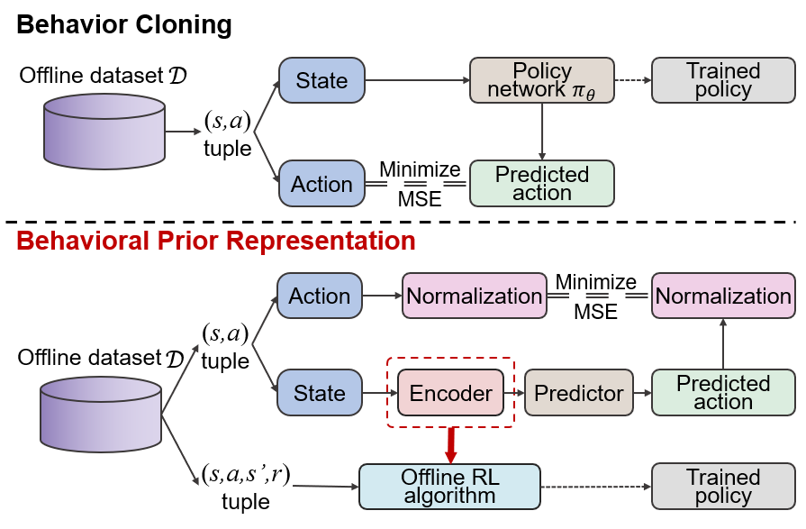

# Behavior Prior Representation learning

This is a pytorch implementation of BPR on [Datasets for Deep Data-Driven Reinforcement Learning](https://github.com/Farama-Foundation/D4RL) (D4RL) and [Challenges and Opportunities in Offline Reinforcement Learning from Visual Observations](https://github.com/conglu1997/v-d4rl) (V-D4RL), the corresponding paper of BPR is [Behavior Prior Representation learning for Offline Reinforcement Learning](https://arxiv.org/pdf/2211.00863.pdf).



## Requirements

The exact requirements depend on the baseline methods, e.g., for applying BPR on CQL, one can follow the requirements from [official repo of CQL](https://github.com/aviralkumar2907/CQL); for applying BPR on visual-d4rl, one can follow the requirements from [official repo of v-d4rl](https://github.com/conglu1997/v-d4rl).

## Description

 This repository is organized by task level, one can find the appropriate codebase based on the task and the corresponding baseline to train the model and evaluate the performance. For example, if one wants to test the performance of CQL+BPR on d4rl, the corresponding link is [here](https://github.com/bit1029public/offline_bpr/tree/main/d4rl/baseline_plus_BPR/CQL_BPR_pretrain).

## Citation
If you find this open source release useful, please reference in your paper:
```
@inproceedings{
zang2023behavior,
title={Behavior Prior Representation learning for Offline Reinforcement Learning},
author={Hongyu Zang and Xin Li and Jie Yu and Chen Liu and Riashat Islam and Remi Tachet des Combes and Romain Laroche},
booktitle={International Conference on Learning Representations},
year={2023},
url={https://openreview.net/forum?id=hQ4K9Bf4G2B}
}
```

## Note
+ If you have any questions, please contact me: zanghyu@gmail.com. 
